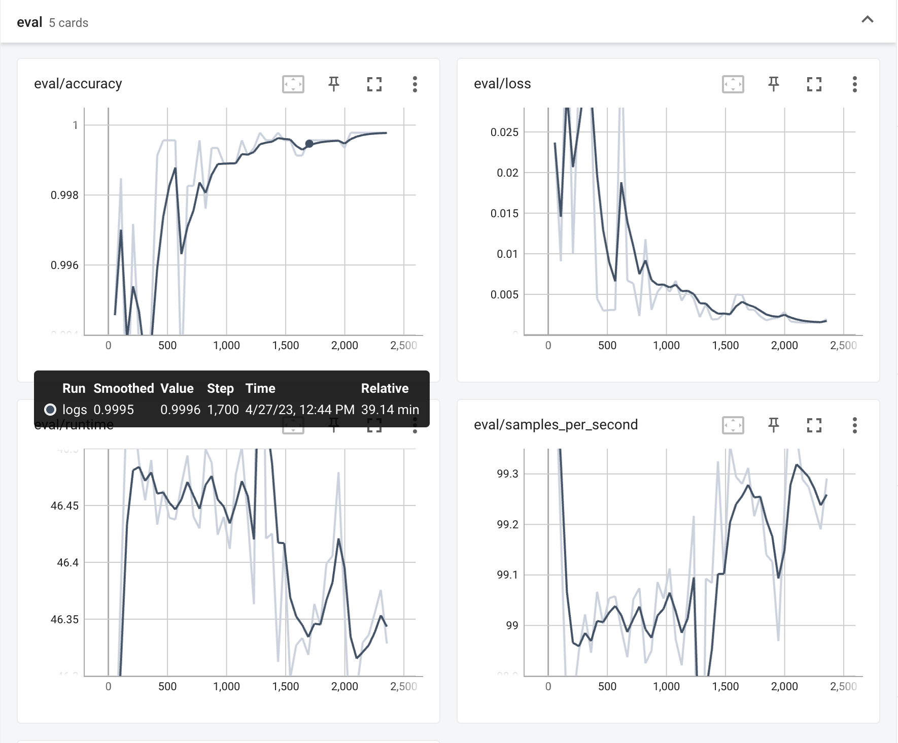

## Overview

This model is a fine-tuned version of **bert-base-chinese** on the **rjxdataset-textclassification-chinese-46000** dataset.

<!--more-->

## Dataset

DatasetDict({
    train: Dataset({
        features: ['label', 'text', 'input_ids', 'token_type_ids', 'attention_mask'],
        num_rows: 36800
    })
    valid: Dataset({
        features: ['label', 'text', 'input_ids', 'token_type_ids', 'attention_mask'],
        num_rows: 4600
    })
    test: Dataset({
        features: ['label', 'text', 'input_ids', 'token_type_ids', 'attention_mask'],
        num_rows: 4600
    })
})

## Training hyperparameters

The following hyperparameters were used during training:

* learning_rate: 2e-05
* train_batch_size: 16
* eval_batch_size: 16
* seed: 42
* optimizer: Adam with betas=(0.9,0.999) and epsilon=1e-08
* lr_scheduler_type: linear
* num_epochs: 1

## Training results

## Test dataset results

{'accuracy': 0.9997826086956522}

## Training time return

Training seconds: 4017
